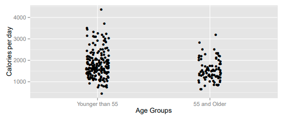
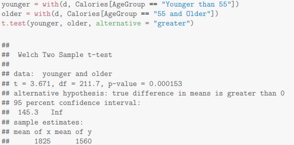

  
187 samples are older men(younger than 55) who consume a mean of 1824.6 calories per day with a standard deviation of 653.2.
86 samples are men(aged and older than 55) who consume a mean of 1560.5 calories per day with a standard deviation of 499.1. 
Here is the output from t.test(): 

1. Define parameters and state null and alternative hypotheses for the test.    
  As it states in the picture, 

        
2. Compute the point estimate and standard error for the difference in sample means. Use formulas and attach your calculation.    

        
3. The computer output provides a test statistic. Use the T test formula to show how it was calculated.    

        
4. How many degrees of freedom would we have used had we used the simpler method?    

        
5. List at least two assumptions that underlie the statistical method used for this test. Are you concerned about the validity of the test? Briefly explain. 