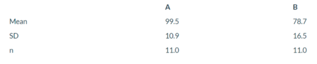

A  preliminary study of weight gain in male rats compared two diets, labelled A and B below, which were formulated in terms of level and sources of protein.
A total of twenty-two rats were randomly assigned to the diets, eleven to each diet. Summary statistics for the weight gains (grams) by the end of the study are shown below.

1. Use R code to carry out a t-test to compare the sample means. State explicitly the null hypothesis, the degrees of freedom for the reference distribution, and the critical values for the test. Interpret the result in practical terms. Attach your R code.

2. Calculate and interpret an appropriate confidence interval. Explain the relationship between a confidence interval and the result of an hypothesis test

3. A colleague asserts that had the raw data been available (instead of the summaries given above), a paired t-test would be the appropriate test for analyzing the study results. Are they correct? Discuss. (You can check the tests by using R code).

4. Explain the difference between a Type I and II error. How does the choice of a significance level ־± relate to these terms?

