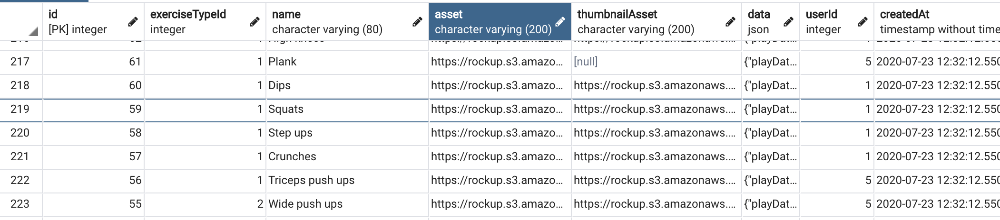
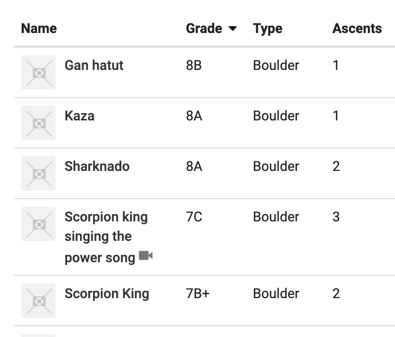
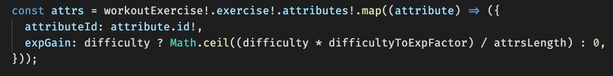
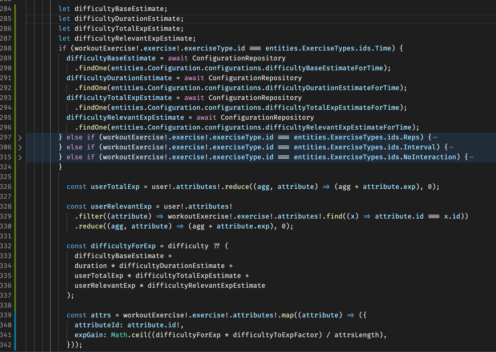

### Dependencies
```{r}
library(rpart);
library(rpart.plot);
```
# Introduction
## The app
[Rockup!](https://rockup.uvop-software.com) is a social app (links to [iOS](https://apps.apple.com/us/app/rockup/id1299641152) and [Android](https://play.google.com/store/apps/details?id=com.hangboardcoach&hl=en) apps) for rock climbing.  
Rockup! was made by Yuval at the start of his studies, and was kept a side project throughout the years.  
Tomer, which also climbs and uses the app, helped inspire some of the features that are in the app today.  
The app has been evolving quite a lot since the beginning, it started as a simple timer for a specific exercise climbers do, and today is a social media platform for working out.  


## Motivation
So since the start of the R class we decided that Rockup! would be a perfect candidate for our project.  
Rockup! was still on version 4 (no social features) at the start of the semester, and version 5 (social features and data) was couple of months to go.  
But once version 5 released, we get to do statistical test on real data, and implement the results right away.  
The only issue was, on what is the data that we want to predict.

## Prediction - difficulty
So Rockup! finally was finally made a social media platform, and all the previous exercises were migrated to the main database (PostgreSQL).  
  
Through the migration we discovered that something was missing.  
Previously the difficulty of each exercise which determined how much experience the user will gain upon completion (gamification, helps motivate to workout), was set manually by us.  

> This raises the question whether the difficulty can be set as a number even though it's different for each individual.  
> In rock climbing, we have different grades for each "problem": (For example, Kisra park in Israel)  
>   
> Those grades a determined by the people who climb the rock, and the grade system is the same throughout the world.  
> Even though we can agree that those grades are probably not accurate and vary for each person and each route, it helps people who are new to the area to choose their workout accordingly.  

We needed a way to determine the difficulty of new exercises the users create (a new feature to this version).  
We are asking users who complete the exercise for the first time what is the difficulty of the exercise, but until we have enough data to decide that value, those users don't gain experience for the exercise.  
To tackle that problem we decided to use this project to develop a prediction algorithm for new exercises, to make sure we have difficulty set for all exercises at all time, and as time progresses, more "weight" will be given to users' feedback instead of the algorithm result for the exercise's difficulty value.  

# Data
So as mentioned earlier, the main database is now PostgreSQL, and that makes it so easy to query and recollect the data.  
Since this project is basically R code, and the data is a SQL query, once we have more exercises and users we can simply rerun the query and rerun this R file a get a new algorithm.  
We are aware that the amount of data is low right now, but the ability to rerun this project and update the algorithm is great.  
Here is the SQL query for the data (not very optimized but that's ok):  
```sql
select 
	e.id,
	e.name,
	et.name "exercise type",
	e.difficulty,
	(
		select string_agg(a.name, '|')
		from exercise_attributes_attribute ea
		inner join attribute a 
			on a.id = ea."attributeId"
		where ea."exerciseId" = e.id
	) "attributes",
	COALESCE(
		(
			select round(avg((weph.data ->> 'duration')::int))
			from workout_exercise we
			inner join workout_exercise_play_history weph
				on we.id = weph."workoutExerciseId"
			where we."exerciseId" = e.id
		),
		(e.data -> 'playData' ->> 'seconds')::int,
		(
			(e.data -> 'playData' ->> 'rounds')::int * ((e.data -> 'playData' -> 'intervals' -> 0 ->> 'seconds')::int) + 
			((e.data -> 'playData' ->> 'rounds')::int - 1) * ((e.data -> 'playData' -> 'intervals' -> 1 ->> 'seconds')::int)
		),
		(e.data -> 'additionalData' ->> 'expectedDuration')::int,
		(e.data -> 'additionalData' ->> 'expectedDurationPerRep')::int * (e.data -> 'playData' ->> 'reps')::int
	)::int "duration",
	(
		select count(1)
		from workout_exercise we
		inner join workout_exercise_play_history weph
			on we.id = weph."workoutExerciseId"
		where we."exerciseId" = e.id
	)::int "play",
	COALESCE(
    (
      select round(avg((
        select COALESCE(sum(uae.exp), 0)
        from user_attribute_exp uae
        where uae."userId" = wph."userId"
      )))
      from workout_exercise we
      inner join workout_exercise_play_history weph
        on we.id = weph."workoutExerciseId"
      inner join workout_play_history wph
        on weph."workoutExerciseId" = wph."id"
      where we."exerciseId" = e.id
    ),
    0
  )::int "Average total exp",
	COALESCE(
    (
      select round(avg((
        select COALESCE(sum(uae.exp), 0)
        from user_attribute_exp uae
        where uae."userId" = wph."userId"
        and uae."attributeId" = 1
      )))
      from workout_exercise we
      inner join workout_exercise_play_history weph
        on we.id = weph."workoutExerciseId"
      inner join workout_play_history wph
        on weph."workoutExerciseId" = wph."id"
      where we."exerciseId" = e.id
    ),
    0
  )::int "Average Finger Strength exp",
	COALESCE(
    (
      select round(avg((
        select COALESCE(sum(uae.exp), 0)
        from user_attribute_exp uae
        where uae."userId" = wph."userId"
        and uae."attributeId" = 2
      )))
      from workout_exercise we
      inner join workout_exercise_play_history weph
        on we.id = weph."workoutExerciseId"
      inner join workout_play_history wph
        on weph."workoutExerciseId" = wph."id"
      where we."exerciseId" = e.id
    ),
    0
  )::int "Average Power exp",
	COALESCE(
    (
      select round(avg((
        select COALESCE(sum(uae.exp), 0)
        from user_attribute_exp uae
        where uae."userId" = wph."userId"
        and uae."attributeId" = 3
      )))
      from workout_exercise we
      inner join workout_exercise_play_history weph
        on we.id = weph."workoutExerciseId"
      inner join workout_play_history wph
        on weph."workoutExerciseId" = wph."id"
      where we."exerciseId" = e.id
    ),
    0
  )::int "Average Endurance exp",
	COALESCE(
    (
      select round(avg((
        select COALESCE(sum(uae.exp), 0)
        from user_attribute_exp uae
        where uae."userId" = wph."userId"
        and uae."attributeId" = 4
      )))
      from workout_exercise we
      inner join workout_exercise_play_history weph
        on we.id = weph."workoutExerciseId"
      inner join workout_play_history wph
        on weph."workoutExerciseId" = wph."id"
      where we."exerciseId" = e.id
    ),
    0
  )::int "Average Flexibility exp",
	COALESCE(
    (
      select round(avg((
        select COALESCE(sum(uae.exp), 0)
        from user_attribute_exp uae
        where uae."userId" = wph."userId"
        and uae."attributeId" = 5
      )))
      from workout_exercise we
      inner join workout_exercise_play_history weph
        on we.id = weph."workoutExerciseId"
      inner join workout_play_history wph
        on weph."workoutExerciseId" = wph."id"
      where we."exerciseId" = e.id
    ),
    0
  )::int "Average Fitness exp"
from exercise e
inner join exercise_type et
	on e."exerciseTypeId" = et.id
where e.difficulty is not null
order by e.id asc
```
```{r}
data = read.csv('data-1596719354676.csv');
head(data);
```

# Exploratory data analysis
To understand the data better, and how to predict difficulty based on other values, let's look at different plots that might shed some light on the data itself
```{r}
difficulties = seq(from = 1, to = 5);

plot(
    x = difficulties,
    y = unlist(Map(function(difficulty) {
      return (nrow(data[data$difficulty == difficulty, ]));
    },difficulties)),
    main = 'Exercise\'s difficulty spread',
    xlab = 'Difficulty',
    ylab = 'Count'
);

plot(
    x = difficulties,
    y = unlist(Map(function(difficulty) {
      return (sum(data[data$difficulty == difficulty, ]$play));
    },difficulties)),
    main = 'Exercise\'s play count',
    xlab = 'Difficulty',
    ylab = 'PLay count'
);

plot(
    x = difficulties,
    y = unlist(Map(function(difficulty) {
      return (median(data[data$difficulty == difficulty, ]$duration));
    },difficulties)),
    main = 'Exercise\'s average duration',
    xlab = 'Difficulty',
    ylab = 'Average duration'
);

plot(
    x = difficulties,
    y = unlist(Map(function(difficulty) {
      return (median(data[data$difficulty == difficulty, ]$Average.total.exp));
    },difficulties)),
    main = 'Exercise\'s average total experience of users who complete it',
    xlab = 'Difficulty',
    ylab = 'Average total experience'
);
```

From those plots we can learn 2 things:  

*  Play count as much as it's a relevant data and a good predictor for difficulty, it cannot be used because it cannot be collected upon exercise's creation.  
*  Difficulty number 4 is not consistent as the rest of the data, but that's is because of the low number of exercises of that difficulty, and it should not matter much when conducting the tests, again, because the low count of that abnormality.  


# Inference
## Manipulate the data
Firstly, we will add some columns to the dataframe to suit our tests better.  
Currently we have Average exp for each attribute, now will will merge those to single "average relevant exp" using the "attributes" column.  
```{r}
dataColNames = colnames(data);
data$Average.relevant.exp = apply(data, 1, function(row) {
  attributesStr = row[5];
  attributes = unlist(strsplit(attributesStr, "\\|"));
  exps = as.numeric(unname(unlist(Map(function(attribute) {
    attributeColName = paste("Average.", gsub(" ", ".", attribute), ".exp", sep = "");
    index = which(dataColNames == attributeColName);
    return (row[index]);
  }, attributes))));
  exp = sum(exps);
  return (exp);
});
summary(data);

plot(
    x = difficulties,
    y = unlist(Map(function(difficulty) {
      return (median(data[data$difficulty == difficulty, ]$Average.relevant.exp));
    },difficulties)),
    main = 'Exercise\'s average relevant experience of users who complete it',
    xlab = 'Difficulty',
    ylab = 'Average relevant experience'
);
```

Difficulty 4 "sticks" to it's abnormality as expected.  

## Selecting the tests
We decided to use decision tree and multiple linear regression tests.  
Decision tree test is great for visualizing the algorithm which decides the exercise's difficulty.  
Multiple linear regression test can be somewhat inconsistent compared to decision tree (is explained down bellow) but is great for implementation in the app.

## Decision tree
Before we train our model, we need to create a train and test set: We train the model on the train set and test the prediction on the test set (i.e. unseen data).  
The common practice is to split the data 80/20, 80 percent of the data serves to train the model, and 20 percent to make predictions.  
We need to create two separate data frames for that.  
We don't want to touch the test set until you finish building your model.  

```{r}
set.seed(1);
n = nrow(data);
datas = data[sample(n),];

# Split the data in train and test
trainAndTestRelation = 0.8;
train_indices = 1:round(trainAndTestRelation * n);
train = datas[train_indices, ];
test_indices = (round(trainAndTestRelation * n) + 1):n;
test = datas[test_indices, ];
```

We are ready to build the model.  
```{r}
tree = rpart(
  difficulty ~ duration + Average.total.exp + Average.relevant.exp,
  data = train,
  method = 'class',
  minsplit = 2,
  minbucket = 5
);
```
We used rpart library (and later rpart.plot for visualization) to create the model, we'll explain each of the different parameters we used:  

*  `difficulty ~ duration + Average.total.exp + Average.relevant.exp` - difficulty is the the value to predict, and duration, average total experience, average relevant experience are the predictors.  
*  `data = train` - We use only the train set to build the model.  
*  `method = 'class'` - "anova" would suit better (as seen down bellow), but because difficulty is a scalar, just for accuracy assessment, we used "class".  
*  `minsplit=2` - A control variable to make sure there will be not only root node with single decision.  
*  `minbucket=5` - A control variable to make sure that there won't be too many sub nodes in the tree, won't have a node (or bucket) with less than 5% confidence.  

As for visualization, this line is all we need:  
```{r}
rpart.plot(tree);
```

Now we will see the accuracy of that tree:  
```{r}
predict_unseen = predict(tree, test, type = 'class');
table_mat = table(test$difficulty, predict_unseen);
table_mat

accuracy_test = sum(diag(table_mat)) / sum(table_mat);
```
We got that the accuracy of the decision tree test is `r accuracy_test`.  

Now a "anova" test, as difficulty is a scalar and can be set any real number between 1 and 5:  
```{r}
tree = rpart(
  difficulty ~ duration + Average.total.exp + Average.relevant.exp,
  data = train,
  method = 'anova',
  minsplit = 2,
  minbucket = 5
);
rpart.plot(tree);
```

## Multiple linear regression
Since the user picks which type of exercise it is before publishing the exercise, we can split the data to different types and develop an algorithm for each type.  
After the first user completes the exercise, the difficulty will be decided by the time it took him (duration), his total experience and his relevant experience.  
As for the algorithms themselves, we chose to use multiple linear regression test as it's very simple to implement later in the app (as seen in the conclusion part).  

* ### Model - Time type
  ```{r}
  mlrTimeModel <- lm(difficulty ~ duration + Average.total.exp + Average.relevant.exp, data = data[data$exercise.type == "Time", ])
  summary(mlrTimeModel);
  ```
  The confidence interval of the model coefficient can be extracted as follow:  
  ```{r}
  confint(mlrTimeModel);
  ```  
  That's why our model equation is  
  ```{r echo=FALSE}
  parameters = summary(mlrTimeModel)$coefficients[,1];
  ```
  difficulty = (`r parameters[1]`) + duration * (`r parameters[2]`) + totalExp * (`r parameters[3]`) + relevantExp * (`r parameters[4]`);
  
* Repetitions 
  ```{r}
  mlrRepetitionsModel <- lm(difficulty ~ duration + Average.total.exp + Average.relevant.exp, data = data[data$exercise.type == "Repetitions", ])
  summary(mlrRepetitionsModel);
  ```
  The confidence interval of the model coefficient can be extracted as follow:  
  ```{r}
  confint(mlrRepetitionsModel);
  ```
  That's why our model equation is  
  ```{r echo=FALSE}
  parameters = summary(mlrRepetitionsModel)$coefficients[,1];
  ```
  difficulty = (`r parameters[1]`) + duration * (`r parameters[2]`) + totalExp * (`r parameters[3]`) + relevantExp * (`r parameters[4]`);

* Interval
  ```{r}
  mlrIntervalModel <- lm(difficulty ~ duration + Average.total.exp + Average.relevant.exp, data = data[data$exercise.type == "Interval", ])
  summary(mlrIntervalModel);
  ```
  The confidence interval of the model coefficient can be extracted as follow:  
  ```{r}
  confint(mlrIntervalModel);
  ```
  That's why our model equation is  
  ```{r echo=FALSE}
  parameters = summary(mlrIntervalModel)$coefficients[,1];
  ```
  difficulty = (`r parameters[1]`) + duration * (`r parameters[2]`) + totalExp * (`r parameters[3]`) + relevantExp * (`r parameters[4]`);

* No interaction
  ```{r}
  mlrNoInteractionModel <- lm(difficulty ~ duration + Average.total.exp + Average.relevant.exp, data = data[data$exercise.type == "No interaction", ])
  summary(mlrNoInteractionModel);
  ```
  The confidence interval of the model coefficient can be extracted as follow:  
  ```{r}
  confint(mlrNoInteractionModel);
  ```
  That's why our model equation is  
  ```{r echo=FALSE}
  parameters = summary(mlrNoInteractionModel)$coefficients[,1];
  ```
  difficulty = (`r parameters[1]`) + duration * (`r parameters[2]`) + totalExp * (`r parameters[3]`) + relevantExp * (`r parameters[4]`);  

### Models accuracy assessment
The overall quality of the model can be assessed by examining the R-squared (R2) and Residual Standard Error (RSE).  

##### R-squared  
```{r}
summary(mlrTimeModel)$r.squared;
summary(mlrRepetitionsModel)$r.squared;
summary(mlrIntervalModel)$r.squared;
summary(mlrNoInteractionModel)$r.squared;
```
In multiple linear regression, the R2 represents the correlation coefficient between the observed values of the outcome variable (difficulty) and the fitted (i.e., predicted) values of the difficulty.  
For this reason, the value of R will always be positive and will range from zero to one.  
R2 represents the proportion of variance, in the outcome variable difficulty, that may be predicted by knowing the value of the predict variables.  
An R2 value close to 1 indicates that the model explains a large portion of the variance in the outcome variable.  
A problem with the R2, is that, it will always increase when more variables are added to the model, even if those variables are only weakly associated with the response.  
A solution is to adjust the R2 by taking into account the number of predictor variables.  
The adjustment in the “Adjusted R Square” value in the summary output is a correction for the number of variables included in the prediction model.  
In our Time model for example, with duration, total experience and relevant experience predictor variables, the adjusted R2 = `r summary(mlrTimeModel)$r.squared`, meaning that “`r summary(mlrTimeModel)$r.squared * 100`% of the variance in the measure of sales can be predicted by duration, total experience and relevant experience values.  

```{r}
  mlrTimeModel21 <- lm(difficulty ~ Average.total.exp + Average.relevant.exp, data = data[data$exercise.type == "Time", ])
  mlrTimeModel22 <- lm(difficulty ~ duration + Average.relevant.exp, data = data[data$exercise.type == "Time", ])
  mlrTimeModel23 <- lm(difficulty ~ duration + Average.total.exp, data = data[data$exercise.type == "Time", ])
  mlrTimeModel11 <- lm(difficulty ~ duration + duration, data = data[data$exercise.type == "Time", ])
  mlrTimeModel12 <- lm(difficulty ~ duration + Average.total.exp, data = data[data$exercise.type == "Time", ])
  mlrTimeModel13 <- lm(difficulty ~ duration + Average.relevant.exp, data = data[data$exercise.type == "Time", ])
```
> The model is better than the than any other variant of the predictors (multiple and single linear models) 
> since it has R2 of `r summary(mlrTimeModel)$r.squared`, which is the highest, and the others are - `r summary(mlrTimeModel21)$r.squared`, `r summary(mlrTimeModel22)$r.squared`, `r summary(mlrTimeModel23)$r.squared`, `r summary(mlrTimeModel11)$r.squared`, `r summary(mlrTimeModel12)$r.squared`, `r summary(mlrTimeModel13)$r.squared`.   

##### Residual Standard Error (RSE), or sigma  
The RSE estimate gives a measure of error of prediction. The lower the RSE, the more accurate the model (on the data in hand).  
The error rate can be estimated by dividing the RSE by the mean outcome variable:  
```{r}
sigma(mlrTimeModel)/mean(data[data$exercise.type == "Time", ]$difficulty);
sigma(mlrRepetitionsModel)/mean(data[data$exercise.type == "Repetitions", ]$difficulty);
sigma(mlrIntervalModel)/mean(data[data$exercise.type == "Interval", ]$difficulty);
sigma(mlrNoInteractionModel)/mean(data[data$exercise.type == "No interaction", ]$difficulty);
```

> In our multiple regression Time model, the RSE is `r sigma(mlrTimeModel)` corresponding to `r sigma(mlrTimeModel)/mean(data[data$exercise.type == "Time", ]$difficulty)`% error rate.  
> Again, this is better than the other variants, where the RSE are `r sigma(mlrTimeModel21)` (`r sigma(mlrTimeModel21)/mean(data[data$exercise.type == "Time", ]$difficulty)`% error rate), 
`r sigma(mlrTimeModel22)` (`r sigma(mlrTimeModel22)/mean(data[data$exercise.type == "Time", ]$difficulty)`% error rate), 
`r sigma(mlrTimeModel23)` (`r sigma(mlrTimeModel23)/mean(data[data$exercise.type == "Time", ]$difficulty)`% error rate), 
`r sigma(mlrTimeModel11)` (`r sigma(mlrTimeModel11)/mean(data[data$exercise.type == "Time", ]$difficulty)`% error rate), 
`r sigma(mlrTimeModel12)` (`r sigma(mlrTimeModel12)/mean(data[data$exercise.type == "Time", ]$difficulty)`% error rate), 
`r sigma(mlrTimeModel13)` (`r sigma(mlrTimeModel13)/mean(data[data$exercise.type == "Time", ]$difficulty)`% error rate).

# Conclusion
## Implementation
Now once we got those equations for each exercise type, usage is pretty easy.  
The server is written in NodeJS and is deployed to AWS cloud server.  
The important bit is where the user sends an event of exercise completion and gains exp for the exercise.  
Previously, this was the code which calculated the experience:  
  
The code takes the difficulty set for the exercise, multiples it with a predefined factor (`difficultyToExpFactor`) which converts the scale of the difficulty (1-5) to experience (0-10k for now) 
and splits it evenly (that's why there is division) between each muscle (attribute in the code) the exercise is set to workout on.  
As we can see, difficulty is not always set, and currently only once we reach a set amount of feedbacks on the exercise, the difficulty is automatically set.  
We want to fix that, so we added that code to the server, and the predictors to the database:  
   
Now there is never a time where a user isn't rewarded for a workout, and when there is enough feedback from the users about the said exercise, it will use their feedback instead.  
We should mention that the predictors aren't hardcoded to the server, and rerunning this R code and updating the values inside the configuration table in PostgreSQL (used by `ConfigurationRepository`) is enough to update the model's equation.  
And Voila! Now even new exercises rewards the users with experience and motivates them to workout harder!  
   